# Parrot90 Hardware

## Plate / Sandwich case
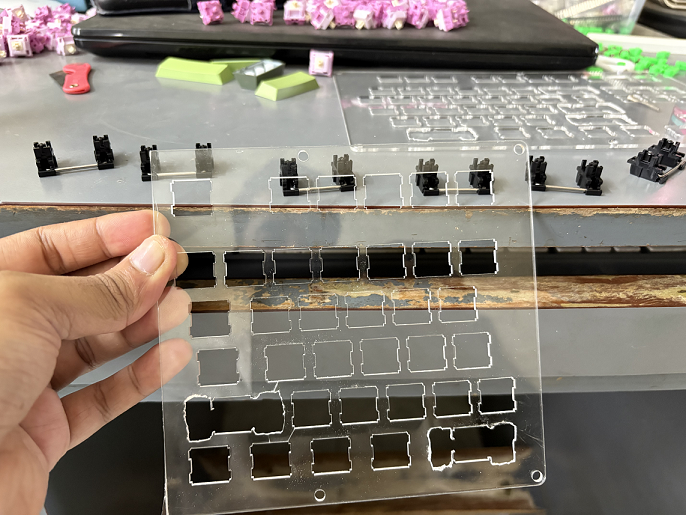
* The plate design files are available in the `./plate` directory.
* You need to laser cut 1.5mm acrylic sheet. If you use a thicker sheet, then you risk the stabilizers not fixing properly in your plate.
* The files `./plate/left_README.md` and `./plate/right_README.md` files contain the details of the design/layout of the keyboard and the open source websites used.

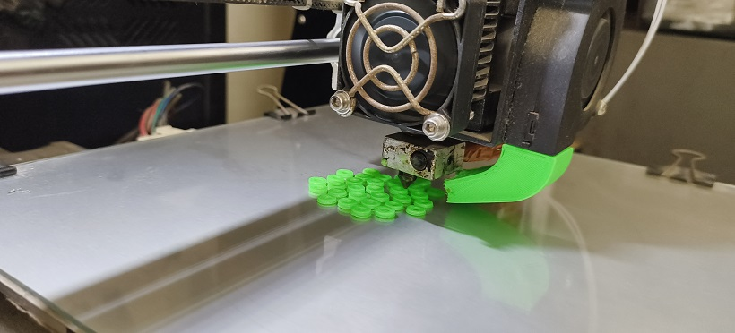
If the fit of the switch in the plate and the hotswap socket in the circuit board do not match properly, you need to 3D print some spacers... More details on this below.

## Circuit
* The circuit is already designed. You can just use the images from `./circuit` directory.
* Note: Use caution while using chemicals. Use internet to learn more before doing.

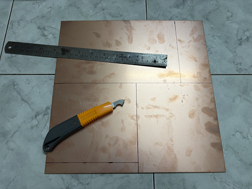

Cut the circuit board into right dimensions

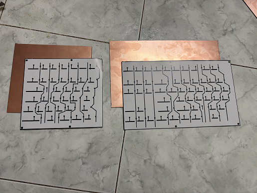

Print the circuits in a shiny photo paper using a Laser printer. Make sure to flip the image

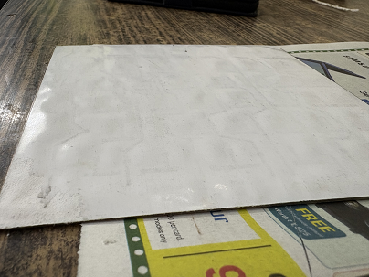

... until you see the paper embossing along the plastic

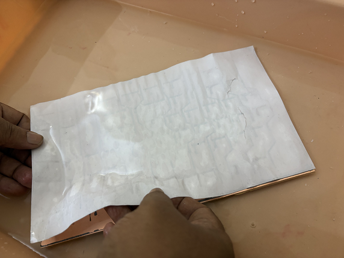

Remove the paper. You can use water too

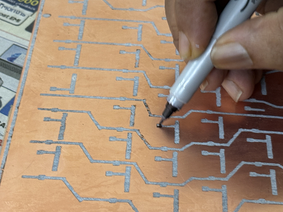

Use a permanent marker to sketch out the parts where circuit has broken

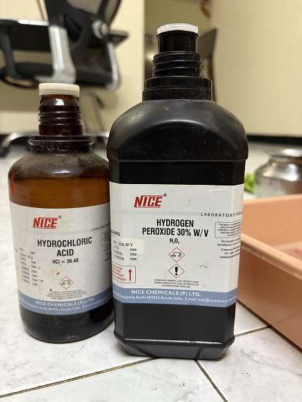

Get the chemicals ready for bathing the circuit. Mix them in a plastic container with water

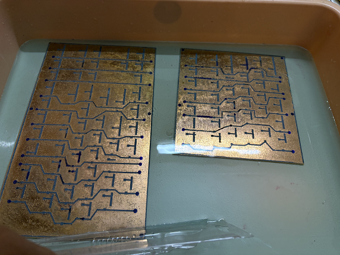

Bathe the circuit boards. Make sure to change proportions according to reaction

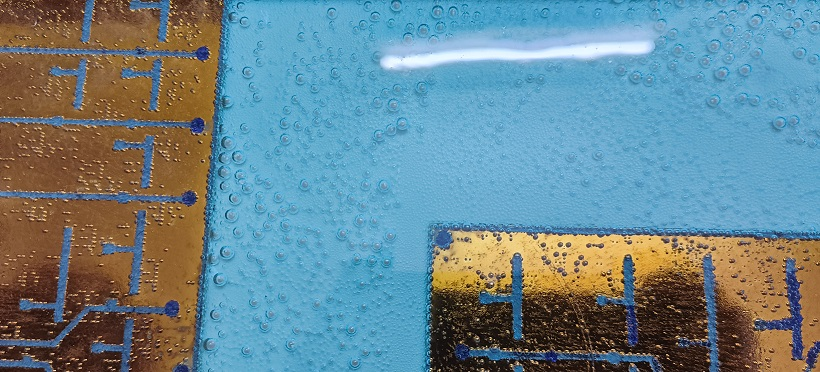

Fizz indicates that the copper is being dissolved out

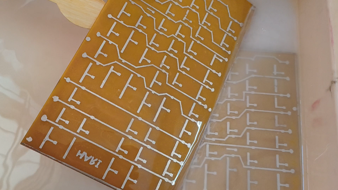

Wash the boards and prepare them for tinning. Bathe them in Tin Chloride and HCL.

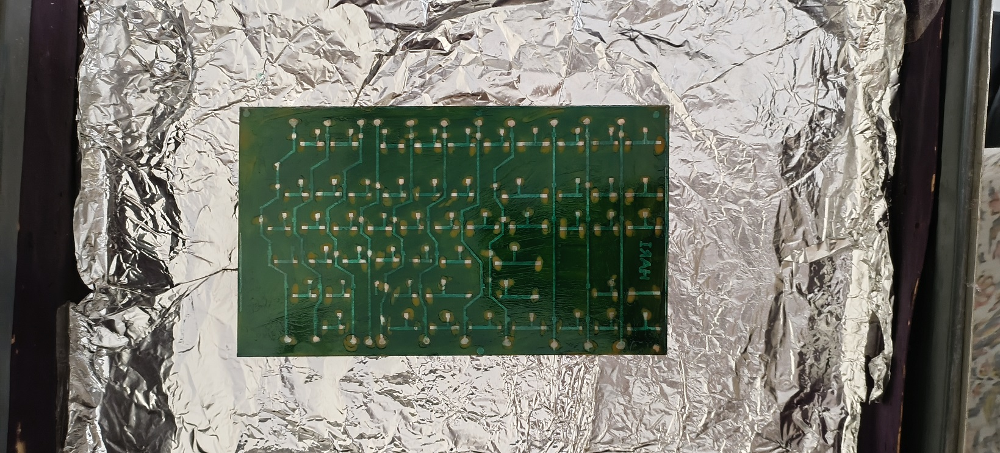

Use a brush and paint solder mask, except in the places where we have copper/tin

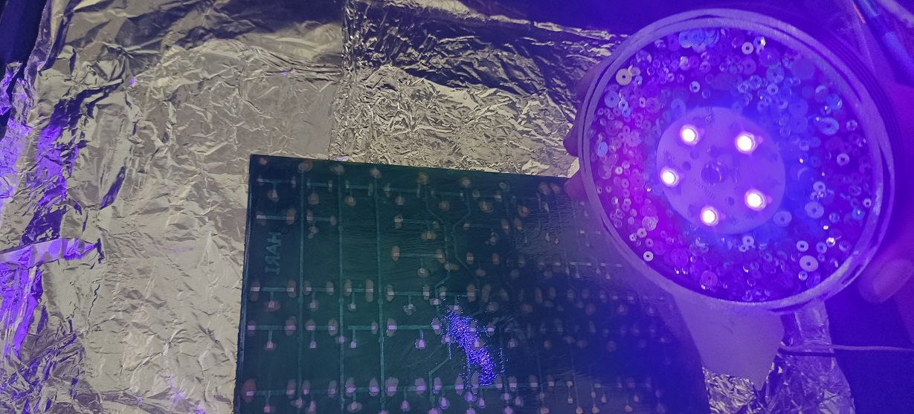

It is nice to have UV lights shined on them to harden them. Else sunlight for a long time.
In case you notice that you put solder mask over circuit, you need to scrape the layer off later.

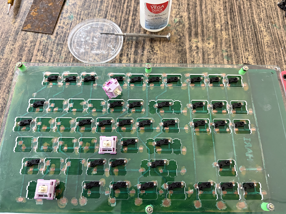

Next stage is to assemble hotswap sockets. Here is what you need to do
* First glue the circuit board to the base acrylic plate.
* Second align the switch plate on to the base plate and fasten them tightly.
* Try attach the hotswap sockets to a switch and insert it into the plate.
* Ensure that the bottom of the sockets is exactly touching the circuit boards and the switch is set in the plate.
* Follow the next step in case you need some spacers to be placed to adjust the fit. This is critical
* Then place a quick glue drop on the bottom of the socket and insert the switch into the plate.
* Wait for sometime and pull out the switch. The hotswap should now be fixed to the circuit board at the right place.
* Repeat this for all the switches.

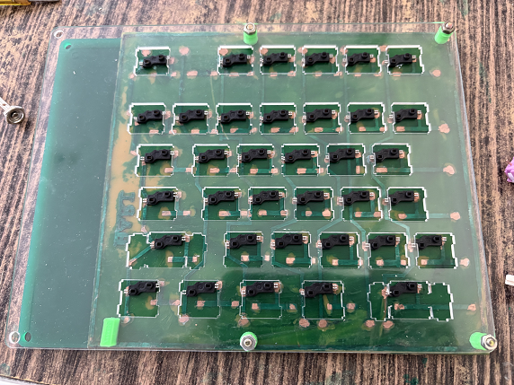

You'll have this now

If the fit of the switch in the plate and the hotswap socket in the circuit board do not match properly, you need to 3D print some spacers...

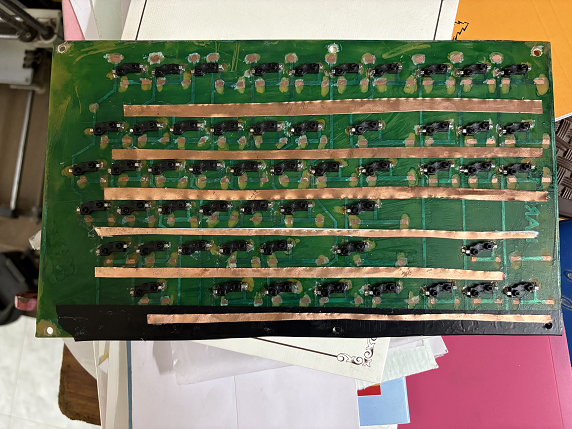

Then glue some copper strips for the rows

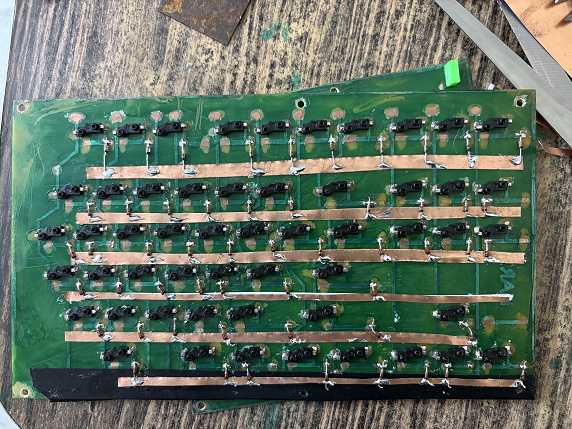

Then solder the diodes

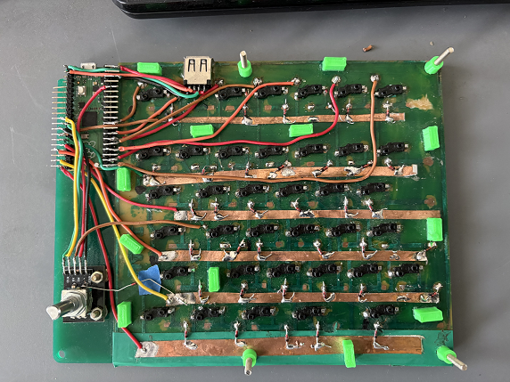

Then solder everything else according to the pins marked in code. Note the UCB connection between the left half and the right half

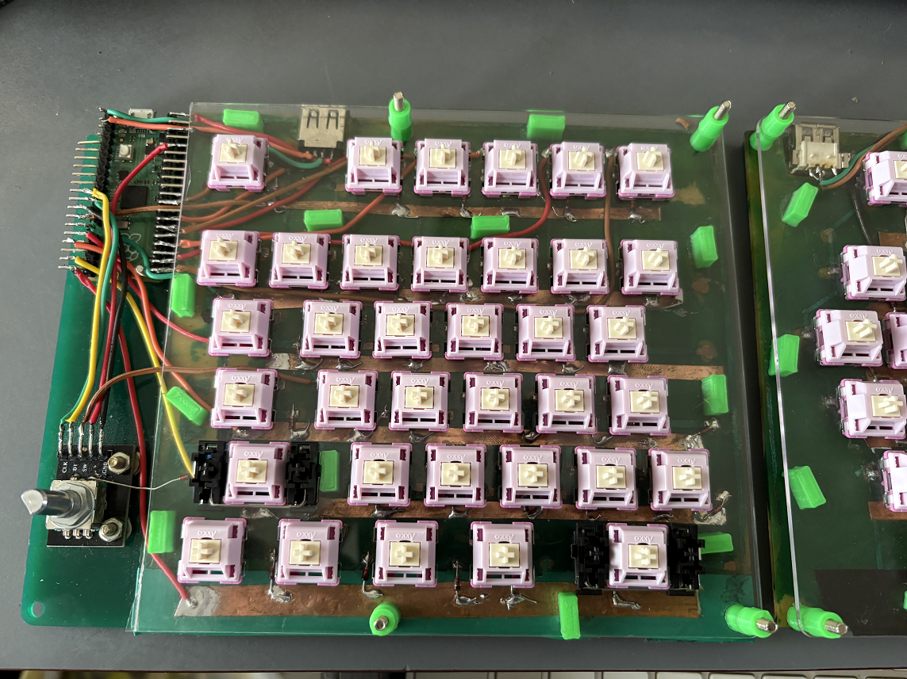
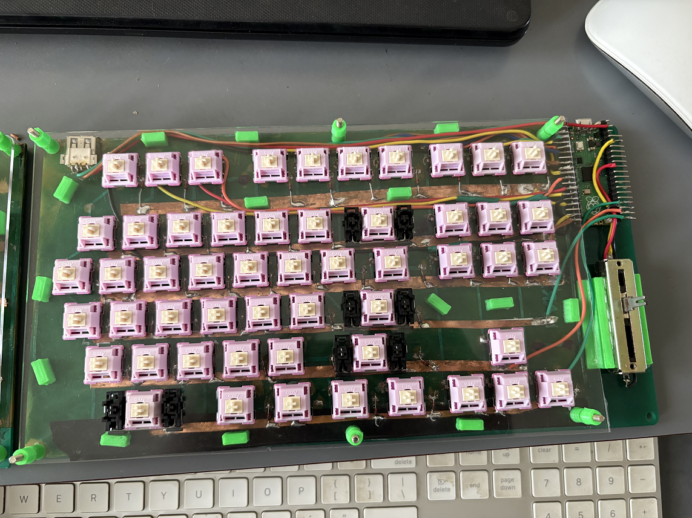
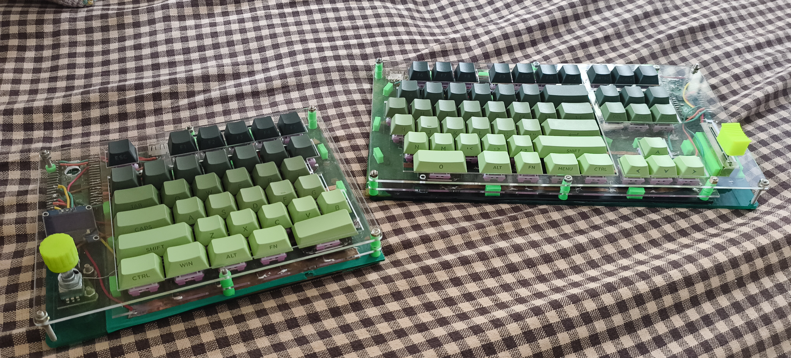

Fix the stabilizers, the switches, keycaps and the other plate layers

### Some other details
* If you would prefer to handwire instead of a circuit board, that can also be done. Just glue the hotswap directly to the base plate and then solder wires.
* The circuit was designed in Adobe Photoshop by working with images (png, jpg, etc).
* We just have to ensure that all the sizes are accurate - size of switch, size of hotswap socket, etc...